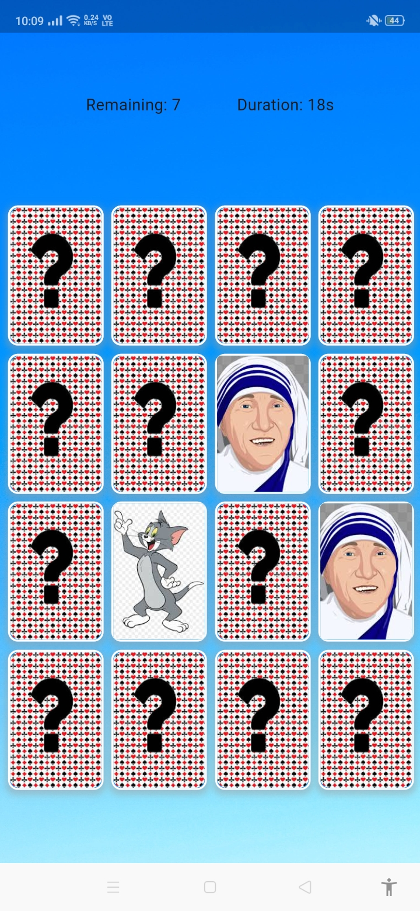
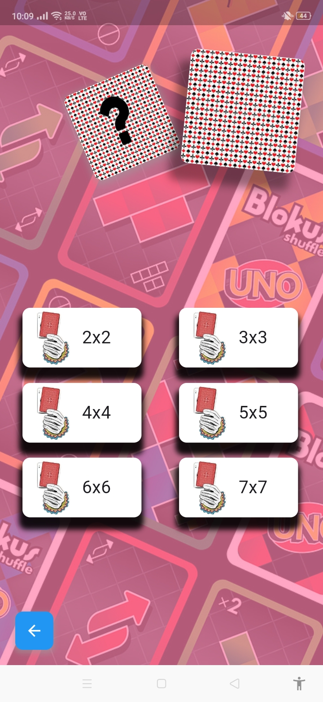

# Memory Game

Memory Game is a simple Flutter app that tests your memory by flipping and matching cards.

## Table of Contents
- [Overview](#overview)
- [Installation](#installation)
- [Folder Structure](#folder-structure)
- [Dependencies](#dependencies)
- [Screenshots](#screenshots)
- [Video](#video)
- [Contributing](#contributing)
- [License](#license)

## Overview
Memory Game is a mobile game developed using Flutter framework. It features a classic memory game where players need to match pairs of cards by flipping them over.

## Installation
To run the app locally, follow these steps:
1. Install [Flutter](https://flutter.dev/docs/get-started/install).
2. Clone this repository: `git clone https://github.com/your-username/memory-game.git`
3. Navigate to the project directory: `cd memory-game`
4. Install dependencies: `flutter pub get`
5. Run the app: `flutter run`

## Folder Structure
memory-game/
│
├── lib/ # Source code directory
│ ├── screens/ # Screens of the app
│ ├── widgets/ # Reusable widgets
│ ├── models/ # Data models
│ └── controllers/ # Controllers for state management
│
├── assets/ # Asset directory
│ ├── images/ # Images used in the app
│ └── videos/ # Videos used in the app
│
├── test/ # Test directory
│ ├── unit/ # Unit tests
│ ├── integration/ # Integration tests
│ └── ui/ # UI tests
│
└── README.md # Project documentation

markdown
Copy code

## Dependencies
- [Flutter SDK](https://flutter.dev)
- [Get](https://pub.dev/packages/get) - Navigation management

## Screenshots

### Video
- App demo usage Video:

https://github.com/alokjha2/flutterGame/blob/main/screenshots/record1.mp4
## Contributing
Contributions are welcome! If you find any bugs or have suggestions for improvements, please create an issue or submit a pull request.

## License
This project is licensed under the MIT License - see the [LICENSE](LICENSE) file for details.